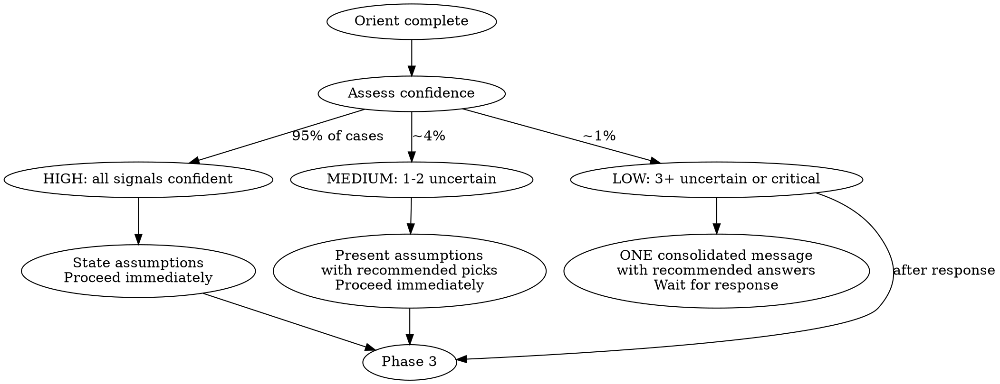

# imma31-plan

**Announce:** "Using imma31-plan to design and break down this feature."

**Thinking mode:** Use ultrathink (extended thinking) for all planning work.

## Key Terms

- **Scope**: Top-level grouping directory under `claude_detailed_plans/`. For monorepos, this is the submodule name. For single-module projects, use the project name.
- **Feature**: The specific feature directory under scope.
- **Task file**: A `TASK-XX_<name>.md` file — one independently-executable unit of work.
- **complete/**: Archive at `claude_detailed_plans/complete/`. Excluded from scans.
- **Build/check command**: From `CLAUDE.md`. If multiple, run all in order.
- **Template feature**: The most architecturally similar existing feature — used as pattern reference.

## Prerequisites

**Required:** A `CLAUDE.md` at the project root describing tech stack, conventions, and build/check command.

**If missing:** Stop and tell the user to create one.

**Created automatically if missing:** `claude_detailed_plans/` directory.

---

## Phase 1: Orient

### Detect the Project and Stack

Do not assume — discover:

1. **Read the project's CLAUDE.md** as the primary source of truth.

2. **Detect the stack** from config files:

   | File | Stack Signal |
   |------|-------------|
   | `go.mod` | Go |
   | `pubspec.yaml` | Flutter/Dart |
   | `package.json` + `svelte.config.*` | SvelteKit |
   | `package.json` + `astro.config.*` | Astro |
   | `package.json` + `next.config.*` | Next.js |
   | `package.json` + `nuxt.config.*` | Nuxt |
   | `Cargo.toml` | Rust |
   | `pyproject.toml` / `requirements.txt` | Python |
   | `pom.xml` / `build.gradle` | Java/Kotlin |
   | `*.csproj` / `*.sln` | .NET / C# |

3. **Identify the build/check command** from CLAUDE.md or infer from stack.

### Record the Stack Profile

Note: project name, root path, scope, stack, build/check command, test command, key conventions.

### Check Existing State

- Read `MASTER_GUIDE.md` if it exists
- Scan existing plans in `claude_detailed_plans/` (excluding `complete/`)
- Read `claude_detailed_plans/learnings/` — embed relevant warnings into TASK files
- Run `git log --oneline -5` for recent momentum

### Handle Empty/New Codebases

If no source code yet, start with scaffold tasks. Reference sibling submodules as template.

---

## Phase 2: Assess Confidence & Decide

**This replaces the old Clarify + Approve gates.** After Orient, assess how much you know:

| Signal | Confident | Uncertain |
|--------|-----------|-----------|
| Feature goal | Clear from user's message | Vague or contradictory |
| Scope/module | Single module or obvious target | Multiple candidates |
| Scale | Fits one feature directory | Needs decomposition |
| Template | Similar feature exists in codebase | Novel architecture needed |
| Priority | Stated or inferable | Ambiguous urgency |

### Smart Defaults

When a signal is uncertain but not critical, apply these defaults rather than asking:

| Question | Default | Override trigger |
|----------|---------|-----------------|
| MVP or full? | **MVP** | User explicitly says "full", "complete", "production-ready" |
| Priority? | **P1** (high) | User specifies otherwise |
| Scope? | **Largest/primary submodule** | Multiple submodules with equal claim |
| Dependencies? | **None assumed** | User mentions cross-feature work |

### Confidence Routing



**HIGH confidence (all signals confident):**
State your assumptions inline in the PLAN.md header. Proceed directly through all remaining phases. No check-in.

**MEDIUM confidence (1-2 uncertain):**
Present your assumptions with your recommended pick. Format:

```
Proceeding with these assumptions (interrupt if any are wrong):
- Scope: `app_name` (only submodule with user-facing UI)
- Scale: MVP — [included] / [excluded]
- Template: following `existing_feature` patterns
- Priority: P1
```

Then proceed immediately. Do NOT wait for a response.

**LOW confidence (3+ uncertain OR critical ambiguity):**
Ask in ONE consolidated message. For each question, present 2-3 options with your recommendation marked. Wait for ONE response. Then proceed through all remaining phases without stopping.

```
I need your input on a few things before planning:

1. **Scope:** A) `module_a` (recommended — closest to this feature) or B) `module_b`?
2. **Scale:** A) MVP with just X and Y (recommended) or B) Full with X, Y, Z, and W?
3. **Architecture:** A) Follow `notifications` pattern (recommended — closest match) or B) New pattern because [reason]?
```

### When to ALWAYS stop (regardless of confidence)

- Feature could **break existing functionality** (destructive changes)
- **Contradictory requirements** between CLAUDE.md and codebase
- **Multiple equally-valid architectures** with significant trade-off differences
- Feature spans **3+ scopes** in a monorepo

---

## Phase 3: Deep Explore

Explore the codebase — no user interaction:

- Find the target feature area
- Study the **template feature** — read its complete structure:
  - File organization, data models, state management
  - Routing, services, UI components
- Read shared infrastructure the new feature depends on
- Identify available packages/modules

### Scope Decomposition Check

Before designing, assess if the feature is too large:

- Does it span 3+ independent subsystems?
- Would it produce more than 12 task files?
- Does it need changes across multiple scopes?

If yes: **decompose into sub-features.** Plan the first sub-feature now. List the rest in PLAN.md's roadmap. Each gets its own planning cycle later.

---

## Phase 4: Design, Generate & Validate

**This combines the old Design, Approve, Generate, and Validate phases into one continuous flow.** No gates between them.

### 4a. Write PLAN.md

Write `claude_detailed_plans/<scope>/<feature>/PLAN.md`:

```markdown
# [Feature Name] Development Plan

**Project:** <project name>
**Scope:** <scope name>
**Stack:** <detected stack>
**Build command:** <detected build/check command>
**Template feature:** <path to reference feature>
**Status:** Not Started
**Priority:** P0 | P1 | P2 | P3
**Assumptions:** <list assumptions made without asking — user can review>
**Last Updated:** YYYY-MM-DD

## Vision
[2-3 sentences: What does this feature do? Why does it matter?]

## Current State
[What exists? What's missing?]

## Roadmap

### Phase 1: [Name] (Target: YYYY-MM-DD)
- [ ] Task 1 - Brief description
- [ ] Task 2 - Brief description

### Phase 2: [Name] (Target: YYYY-MM-DD)
- [ ] Task 1 - Brief description

## Dependencies
- **Requires:** [Other features this depends on]
- **Blocks:** [Features waiting on this]

## Technical Notes
[Architecture decisions, patterns to follow, gotchas]

## Scope Excluded (for later)
[What was deliberately left out of MVP]
```

### 4b. Generate Task Files

Immediately generate TASK files — no approval gate.

Study the template feature for correct layer ordering:

- **Backend:** Models -> DB/migrations -> Services -> Handlers -> Routes -> Config
- **Frontend SPA:** Types -> State/stores -> Services -> Layout -> Pages -> Components -> Routes
- **Mobile (Flutter, RN):** Models -> Data services -> State management -> Widgets -> Screens -> Navigation
- **Static sites:** Types/data -> CMS -> Layouts -> Pages -> Interactive components -> Build config

One `TASK-XX_<name>.md` per independently-executable unit in `claude_detailed_plans/<scope>/<feature>/`:

```markdown
# Task XX: <Title>

**Status:** Not started
**Depends on:** <task numbers or "Nothing">
**Scope:** <scope name>
**Stack:** <detected stack>
**Creates:** N new files  /  **Modifies:** N existing files

## Goal
<one paragraph>

## Files to Create/Modify

### 1. `<relative/path/to/file>`
<description + complete code outline with all imports>

## Key Patterns to Follow
<bullet list referencing template feature by file path>
<warnings from learnings if applicable>

## Verification
<build/check command>
```

**Task file rules:**
- One task per architectural layer
- Data-layer code must be COMPLETE — not pseudocode
- UI tasks: structural outline with state fields, component tree, action handlers
- Every file path verified against codebase via Glob/Grep
- Each task compiles independently after its dependencies are done
- Include ALL imports each file needs
- Reference template feature by path for each pattern
- **Status values:** `Not started`, `In Progress`, `Complete`, `Failed`, `Blocked`

**Design for isolation** (each task should):
- Have one clear purpose
- Communicate through well-defined interfaces
- Be understandable without reading other tasks' internals
- If growing too large, split — that signals it's doing too much

### 4c. Create README.md

```markdown
# <Feature Name> — Implementation Guide

## Overview
<what and why>

## Project & Stack
<project, scope, detected stack>

## Architecture
<directory tree of all files to create/modify>

## Task Execution Order
<ASCII dependency graph showing parallel opportunities>

## Task Summary
| # | Task | Creates/Modifies | Depends On |
|---|------|-----------------|------------|

## Key Patterns
<patterns from template feature>

## Reference Files
| Pattern | Reference File |
|---------|---------------|

## Dependencies
<packages needed — present vs need adding>
```

### 4d. Self-Validate (automated, no user interaction)

Review all generated files:
1. Can each task be given to an agent with only CLAUDE.md as context?
2. All data paths, import paths, file paths correct?
3. Names avoid conflicts with existing code?
4. Route paths unique and follow conventions?
5. No gaps in dependency chain?

Check for common gaps:
- Database migrations or schema changes?
- Config / environment variable updates?
- Route registration or navigation wiring?
- Type exports or barrel file updates?
- Build config changes?

Fix any issues found. Do NOT ask the user about them.

---

## Phase 5: Update MASTER_GUIDE

Update `MASTER_GUIDE.md` at the project root (create if missing):

```markdown
# [Project Name] Development Master Guide

**Last Updated:** YYYY-MM-DD

## Project Overview
[Core value proposition]

## Architecture
| Scope | Role | Stack |
|-------|------|-------|

## Current Sprint
**Focus:** [Current priority]
**Target:** [Sprint end date]

| Scope | Feature | Status | Priority | Next Action |
|-------|---------|--------|----------|-------------|

## Roadmap

### Now (Active)
### Next (Upcoming)
### Later (Backlog)

## Decision Log
| Date | Decision | Rationale |
|------|----------|-----------|

## Learnings
[Link to learnings files]
```

Update on every run: sprint table, roadmap, decision log, timestamp.

---

## Phase 6: Present Summary

Present the completed plan as an **informational summary** — not an approval gate:

```
## Planned: [Feature Name]

**Assumptions made:** [list — user can challenge any]
**Tasks generated:** N files in `claude_detailed_plans/<scope>/<feature>/`
**New files:** N / **Modified files:** N
**Parallel groups:** [which tasks can run concurrently]

Ready for `/imma3-execute` when you are.

<details>
<summary>Full task list</summary>

| # | Task | Depends On |
|---|------|------------|
| 01 | ... | Nothing |
| 02 | ... | 01 |

</details>
```

The user reviews the generated files at their leisure. No "approve?" question.

---

## Interrupt Protocol

The user can interrupt the autonomous flow at ANY point:

| User says | Action |
|-----------|--------|
| "stop" / "wait" | Pause and discuss |
| "change X" | Modify assumption, re-run affected phases |
| "too big" | Trigger scope decomposition |
| "skip to tasks" | Jump to task generation with current understanding |
| "why did you..." | Explain the assumption or decision |

---

## Key Principles

- **NEVER commit to git** — the user manages their own git workflow
- **Detect, don't assume** — discover the stack from project files
- **CLAUDE.md is king** — follow its conventions
- **Read before writing** — understand existing code before planning
- **Follow existing patterns** — template feature is source of truth
- **Autonomy by default** — proceed unless genuinely blocked
- **Smart defaults over questions** — MVP, P1, largest scope, no deps
- **One check-in max** — if you must ask, consolidate into one message with recommendations
- **Actionable tasks** — each completable in one agent session
- **Central storage** — all plans in `claude_detailed_plans/`
- **No guessing** — verify every path against the codebase
- **Learnings feed forward** — past mistakes inform better plans
- **Design for isolation** — each task has one clear purpose and clean interfaces

## Follow-up Commands

After planning:
- `/imma3-execute` — execute tasks using parallel agents
- `/imma3-review` — review generated code and capture learnings
